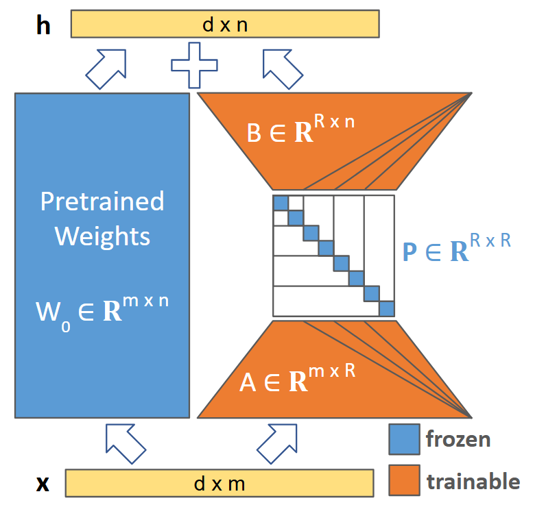

<h1>
    <p> MatryoshkaLoRA: Learning Accurate Hierarchical Low-Rank Representations for LLM Fine-Tuning</p>
</h1>
<hr>
<h1> 
    
</h1>
<hr>

This repository contains the implementation of the paper [MatryoshkaLoRA-Learning Accurate Hierarchical Low-Rank Representations for LLM 
Fine-Tuning](https://huggingface.co/papers/2605.07850).

## Reproducing Paper Results

### Create a conda environment:
```bash
conda create --name matryoshka_lora python=3.12 -c conda-forge --override-channels -y
conda activate matryoshka_lora
pip install -r requirements.txt
```

### Running Experiments
**Using bash:**
```bash
bash scripts/bash_run.sh your-wandb-entity # wandb entity is given as parameter $1
```

**Using GridSearcher:**

If you have direct SSH access to a machine with 8 GPUs, we recommend defining the parameter grid in 
`scripts/gridsearcher_run.py`.

This script allows running hyper-parameter tuning using the predefined grid, does a basic GPU scheduling and uses templates to embed the 
hyper-parameter values efficiently with minimal effort:

```bash
python3 scripts/gridsearcher_run.py --wandb_entity=your-wandb-entity --script_path=~/MatryoshkaLoRA/train.py --root_dir=~/MatryoshkaLoRA/results
```

**Running Extra Evals**
If you train adapters on Open Platypus and log them to WandB, you can use the script `single_eval/run_single_evals.py` to loop through 
all WandB runs and evaluate the models on `ARC-Challenge` and `HellaSwag`.

## Citation
If you find **MatryoshkaLoRA** useful, please consider giving a star and citation:
```bibtex
@misc{modoranu2026matryoshkalora,
      title={MatryoshkaLoRA: Learning Accurate Hierarchical Low-Rank Representations for LLM Fine-Tuning}, 
      author={Ionut-Vlad Modoranu and Mher Safaryan and Dan Alistarh},
      year={2026},
      eprint={2605.07850},
      archivePrefix={arXiv},
      primaryClass={cs.CL},
      url={https://arxiv.org/abs/2605.07850}, 
}```